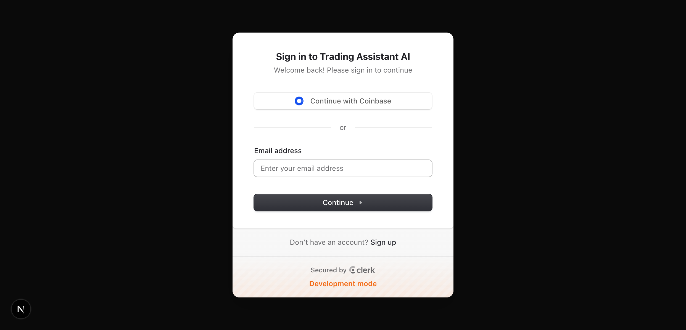
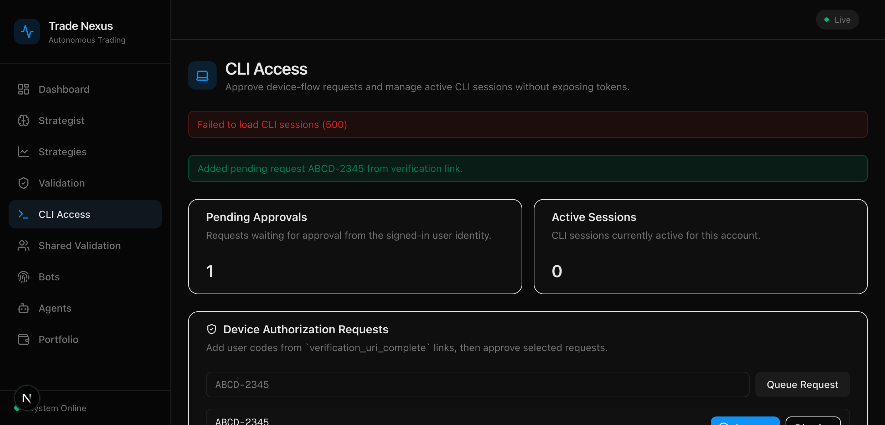

# CLI Access Auto-Queue Flow Evidence

Date: 2026-03-04  
Branch: `codex/web-cli-access-autoq`

## 1) Unauthenticated redirect keeps `user_code`

Input URL:

- `/sign-in?redirect_url=%2Fcli-access%3Fuser_code%3DABCD-2345`

Observed:

- Sign-in page rendered with `redirect_url` including `/cli-access?user_code=ABCD-2345`.
- Sign-up link also preserved the same redirect target.

Screenshot:

Automated coverage:

- `frontend/src/lib/auth/__tests__/sign-in-redirect.test.ts`
  - relative redirect with `user_code` preserved
  - absolute redirect with `user_code` preserved
  - fallback redirect behavior

## 2) Auto-queue appears in pending list

Input URL:

- `/cli-access?user_code=ABCD-2345`

Observed:

- Banner: `Added pending request ABCD-2345 from verification link.`
- Pending Approvals count incremented to `1`.
- Pending list row includes `ABCD-2345`.

Screenshot:

Automated coverage:

- `frontend/src/lib/validation/__tests__/cli-access-state.test.ts`
  - `auto-queue request appears in pending rows with approve action visible`
  - `re-queues user_code when owner scope changes after sign-in`

## 3) Approve action appears without manual input

Observed in the same auto-queue flow:

- `Approve` button visible for the auto-queued row before typing any manual code.

Automated coverage:

- `buildValidationCliPendingApprovalRows` maps queued rows with `showApproveAction: true`
- page consumes row model and renders Approve action from queued state

## Validation Commands

Frontend:

- `cd frontend && bun run test`
- `cd frontend && bun run typecheck`

Governance-equivalent local checks:

- `npm --prefix docs/portal-site run ci`
- `python3 scripts/docs/generate_llm_package.py`
- `python3 scripts/docs/check_llm_package.py`
- `npx --yes --package=@redocly/cli@1.34.5 --package=react@18.3.1 --package=react-dom@18.3.1 --package=styled-components@6.3.5 redocly lint docs/architecture/specs/platform-api.openapi.yaml`
- `PYTHONPATH=backend pytest backend/tests/contracts/test_openapi_contract_baseline.py`
- `PYTHONPATH=backend pytest backend/tests/contracts/test_openapi_contract_freeze.py`
- `PYTHONPATH=backend pytest backend/tests/contracts/test_openapi_contract_v2_baseline.py`
- `PYTHONPATH=backend pytest backend/tests/contracts/test_openapi_contract_v2_validation_freeze.py`
- `PYTHONPATH=backend pytest backend/tests/contracts/test_validation_schema_contract.py`
- `PYTHONPATH=backend pytest backend/tests/contracts/test_sdk_validation_contract_shape.py`
- `PYTHONPATH=backend python -m src.platform_api.validation.release_gate_check --output .ops/artifacts/validation-replay-gate-contracts-governance.json`
- `PYTHONPATH=backend pytest backend/tests/contracts --ignore=backend/tests/contracts/test_openapi_contract_baseline.py --ignore=backend/tests/contracts/test_openapi_contract_freeze.py --ignore=backend/tests/contracts/test_openapi_contract_v2_baseline.py --ignore=backend/tests/contracts/test_openapi_contract_v2_validation_freeze.py --ignore=backend/tests/contracts/test_validation_schema_contract.py --ignore=backend/tests/contracts/test_sdk_validation_contract_shape.py`
- `python3 contracts/scripts/check-slo-alert-baseline.py`
- `NPM_CONFIG_CACHE=/Users/txena/.npm bash contracts/scripts/verify-sdk-drift.sh`
- `NPM_CONFIG_CACHE=/Users/txena/.npm bash contracts/scripts/mock-smoke-test.sh`
- `NPM_CONFIG_CACHE=/Users/txena/.npm bash contracts/scripts/mock-consumer-contract-test.sh`
- `NPM_CONFIG_CACHE=/Users/txena/.npm bash contracts/scripts/check-breaking-changes.sh`
