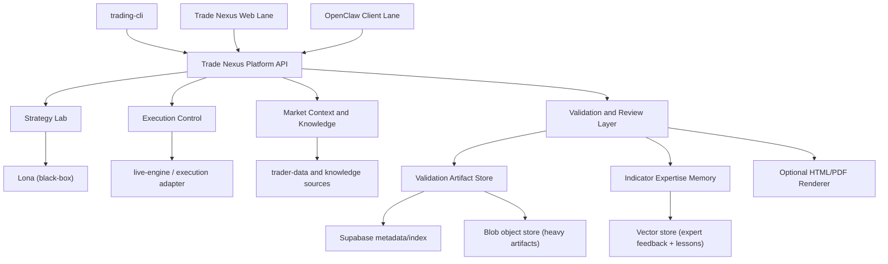

# Strategy Validation And Review Layer

## Purpose

Define a production-grade validation layer around Lona (treated as a black box) that:

1. validates strategy quality and indicator fidelity,
2. produces machine-readable artifacts for deterministic and agent review,
3. supports optional trader-in-the-loop approval workflows,
4. blocks merge and release when regression policy fails.

## Binding Decisions

1. Canonical validation artifact is JSON-first.
2. HTML/PDF are optional render outputs generated on demand.
3. Validation uses hybrid lanes:
   - deterministic assertions (hard gate),
   - agent reviewer (evidence + reasoning),
   - optional human trader review (switchable per run).
4. Lona internals are unchanged; integration stays adapter-based.
5. Production validation paths are fail-closed (no in-memory/mock fallback in prod).

## Ecosystem Placement



## Validation Lanes

### 1) Deterministic Lane (blocking)

Runs on every required validation profile and enforces:

1. indicator declared vs rendered presence checks,
2. trade lifecycle coherence checks,
3. metrics recomputation/tolerance checks,
4. data lineage completeness checks.

### 2) Agent Lane (required, policy-tuned)

Agent reviews compact artifact + selected raw evidence snippets and produces:

1. findings with evidence references,
2. confidence/priority,
3. recommendation (`pass`, `conditional_pass`, `fail`).

### 3) Trader Lane (optional per run)

Human review is enabled only when requested by policy. Reviewer can:

1. inspect artifact,
2. add comments,
3. approve/reject.

## Validation Profiles

| Profile | Use | Blocking Scope | Time Budget |
|---|---|---|---|
| `FAST` | PR merge gate | deterministic hard checks + minimal agent checks | low latency |
| `STANDARD` | default run validation | deterministic + full compact agent review | medium |
| `EXPERT` | release gate or explicit trader request | deterministic + deep agent review + optional human review package | highest |

Profiles are policy-configurable and explicitly recorded in each run artifact.

## Canonical Artifact Schema (JSON-First)

`validation_run.json` is the canonical record:

```json
{
  "schemaVersion": "validation-run.v1",
  "runId": "valrun-20260217-0001",
  "createdAt": "2026-02-17T10:30:00Z",
  "requestId": "req-validation-run-001",
  "tenantId": "tenant-001",
  "userId": "user-001",
  "strategyRef": {
    "strategyId": "strat-001",
    "provider": "lona",
    "providerRefId": "lona-strategy-123"
  },
  "inputs": {
    "prompt": "Build zig-zag strategy for BTC 1h with trend filter",
    "requestedIndicators": ["zigzag", "ema"],
    "datasetIds": ["dataset-btc-1h-2025"],
    "backtestReportRef": "blob://validation/valrun-20260217-0001/backtest-report.json"
  },
  "outputs": {
    "strategyCodeRef": "blob://validation/valrun-20260217-0001/strategy.py",
    "backtestReportRef": "blob://validation/valrun-20260217-0001/backtest-report.json",
    "tradesRef": "blob://validation/valrun-20260217-0001/trades.json",
    "executionLogsRef": "blob://validation/valrun-20260217-0001/execution.log",
    "chartPayloadRef": "blob://validation/valrun-20260217-0001/chart-payload.json"
  },
  "deterministicChecks": {
    "indicatorFidelity": { "status": "pass", "missingIndicators": [] },
    "tradeCoherence": { "status": "pass", "violations": [] },
    "metricConsistency": { "status": "pass", "driftPct": 0.8 }
  },
  "agentReview": {
    "status": "pass",
    "summary": "No indicator/render drift detected.",
    "findings": []
  },
  "traderReview": {
    "required": false,
    "status": "not_requested",
    "comments": []
  },
  "policy": {
    "profile": "STANDARD",
    "blockMergeOnFail": true,
    "blockReleaseOnFail": true,
    "blockMergeOnAgentFail": true,
    "blockReleaseOnAgentFail": false,
    "requireTraderReview": false,
    "hardFailOnMissingIndicators": true,
    "failClosedOnEvidenceUnavailable": true
  },
  "finalDecision": "pass"
}
```

`validation_llm_snapshot.json` (token-optimized) includes only minimal fields needed for agent reasoning and references to heavy evidence blobs.

## Interface Additions (Proposed)

Additive endpoints (to be added to OpenAPI before implementation):

1. `POST /v2/validation-runs`
2. `GET /v2/validation-runs/{runId}`
3. `GET /v2/validation-runs/{runId}/artifact`
4. `POST /v2/validation-runs/{runId}/review`
5. `POST /v2/validation-runs/{runId}/render` (html/pdf optional)
6. `POST /v2/validation-baselines`
7. `POST /v2/validation-regressions/replay`

## Storage Strategy

1. Supabase:
   - run metadata,
   - review state,
   - baseline index,
   - policy and gate decisions.
2. Blob storage:
   - heavy artifacts (logs, trades, chart payloads, generated HTML/PDF).
3. Vector memory:
   - indicator expertise,
   - accumulated review lessons,
   - AI and human feedback embeddings.

## Regression Policy

1. Missing required indicator render => hard fail.
2. Deterministic validation fail => block merge and release.
3. Agent lane fail:
   - merge/release behavior controlled by profile policy.
4. Trader review required only when explicitly requested by run policy.

## Portability To Lona

Validation should be packaged as a module with clear ports:

1. `validation-core` (domain checks + schema),
2. `validation-connectors` (Lona/engine/data evidence adapters),
3. `validation-store` (Supabase/blob/vector adapters),
4. `validation-render` (optional output rendering).

This allows future embedding into Lona or `lona-gateway` with minimal rewrite.

## Non-Goals (Current Wave)

1. Redesign Lona internals.
2. Replace current strategy/backtest engines.
3. Force trader approval for every run.
