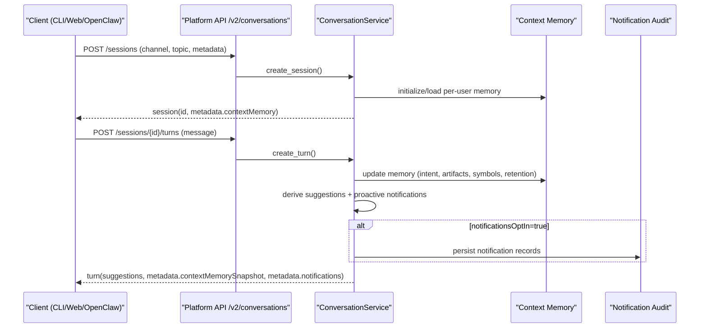

# Gate4 Conversation Contract

Source: `docs/portal/platform/gate4-conversation-contract.md`
Topic: `platform`
Stable ID: `portal_gate4_conversation_contract_v1`

# Gate4 Conversation Contract

## Objective

Define one conversation contract shared by CLI, Web, and OpenClaw, with additive `/v2` API semantics.

## Endpoints

- `POST /v2/conversations/sessions`
- `GET /v2/conversations/sessions/{sessionId}`
- `POST /v2/conversations/sessions/{sessionId}/turns`

## Core Semantics

1. Session creation requires explicit `channel` value.
2. Channel enum is normalized: `cli | web | openclaw`.
3. Turn creation appends immutable turn records and updates session timestamps.
4. Missing session IDs return canonical `ErrorResponse` with `404`.
5. Conversation contract is additive under `/v2`; `/v1` remains unchanged.

## Context Memory Semantics (CONV-02)

1. Memory is scoped per `tenant_id:user_id` and reused across that user's conversation sessions.
2. Each turn updates bounded context memory:
  - recent messages (bounded by retention policy),
  - inferred intent (`deploy | backtest | order | risk | portfolio`),
  - linked trading artifacts (`strat-*`, `dep-*`, `ord-*`, `portfolio-*`, `bt-*`, `dataset-*`),
  - symbol references (for example `BTCUSDT`).
3. Session metadata exposes current memory under `contextMemory`.
4. Turn metadata includes `contextMemorySnapshot` so clients can render deterministic multi-turn context.
5. Memory is isolated by user identity and does not leak across users.

## Proactive Suggestions and Notifications (CONV-03)

1. Turn processing emits proactive suggestions based on message intent and context-memory state.
2. Notification delivery is controlled by session-level opt-in (`metadata.notificationsOptIn`).
3. Opted-in sessions receive structured notification payloads in turn metadata.
4. Every emitted notification writes an audit record with session/turn identity and severity/category metadata.
5. Opted-out sessions still receive suggestions but no notification emission.

## Sequence: Multi-Turn Contract Flow

## Failure and Fallback Behavior

| Condition | Expected Response | Client Handling |
| --- | --- | --- |
| Unknown session ID | `404 CONVERSATION_SESSION_NOT_FOUND` | Surface error with `requestId`; do not synthesize a replacement session |
| Invalid turn payload | `422` validation error | Prompt user to correct payload; keep existing session state |
| Notification opt-out | `notifications=[]` and no audit writes | Continue with suggestions-only UX |
| Internal error | canonical `ErrorResponse` with `requestId` | Preserve correlation ID and retry through same Platform API route only |

## Client Compatibility Notes

1. OpenClaw must create sessions with `channel=openclaw`.
2. CLI/Web/OpenClaw all consume identical `/v2/conversations/*` schemas.
3. Clients should treat `contextMemory` and `contextMemorySnapshot` as additive metadata fields.
4. Clients should not assume notification presence; respect opt-in behavior.

## Boundary Alignment

- Conversation is a public contract concern, not a provider integration.
- Conversation routes remain inside Platform API.
- Provider boundaries are unchanged: adapter-only integrations.

## Traceability

- OpenAPI: `/docs/architecture/specs/platform-api.openapi.yaml`
- Interface definition: `/docs/architecture/INTERFACES.md`
- Parent epics: `#80`, `#106`, `#81`
- Gate4 docs issue: `#137`
