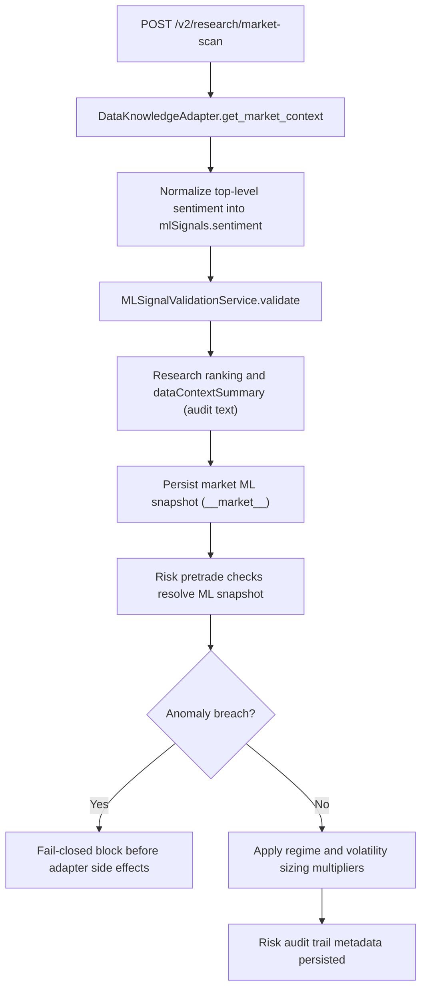

# Gate5 ML Signal Integration and Safety

Source: `docs/portal/platform/gate5-ml-signal-integration.md`
Topic: `platform`
Stable ID: `portal_gate5_ml_signal_integration_v1`

# Gate5 ML Signal Integration and Safety

## Objective

Document the Gate5 ML wiring that augments research and risk paths without allowing opaque model output to drive side effects.

## Signal Contract Matrix

| Signal | Input Fields | Validation Rules | Deterministic Fallback | Runtime Usage | Audit Surface |
| --- | --- | --- | --- | --- | --- |
| `prediction` | `direction`, `confidence` | `direction` in `bullish/bearish/neutral`; confidence normalized to `0..1` | direction -> `neutral`; confidence -> `0.0` | Research idea ranking bias only | `dataContextSummary`, `fallbackReasons` |
| `sentiment` | `score`, `confidence`, optional source metadata | score normalized to `0..1`; confidence normalized to `0..1`; top-level `sentiment` merged into `mlSignals.sentiment` | score -> `0.5`; confidence -> `0.0` | Research scoring/context summary only | `dataContextSummary` includes score/confidence/source/lookback and fallback markers |
| `volatility` | `predictedPct`, `confidence` | `predictedPct >= 0`; confidence in `0..1`; high-confidence tiers map to fixed sizing multipliers | multiplier -> `1.0`; source -> `fallback`; explicit reason recorded | Risk pretrade sizing only | Risk audit metadata (`volatilityForecast*`, `volatilityFallback*`) |
| `anomaly` | `isAnomaly`, `score`, `confidence` | score and confidence coerced to `0..1`; breach requires `isAnomaly=true`, `score>=0.8`, `confidence>=0.7` | clear anomaly state with explicit fallback reason | Research risk flags + Risk fail-closed gate | `dataContextSummary`, `mlAnomaly*` audit fields |
| `regime` | `label/regime/state`, `confidence` | alias normalization to `risk_on/neutral/risk_off`; confidence threshold `>=0.55` | `neutral` regime and multiplier `1.0` with fallback reason | Research context + Risk sizing multiplier | `dataContextSummary`, `mlRegime*` audit fields |

## Validation and Fallback Rules

1. ML signals are optional inputs; missing payloads never crash the request path.
2. Confidence values above `1.0` are normalized as percentages (`x / 100`) where applicable.
3. Out-of-range values become deterministic fallback defaults and append explicit fallback reason codes.
4. Regime confidence below `0.55` forces `neutral` regime behavior.
5. Volatility confidence below `0.55` forces multiplier `1.0`.
6. Anomaly breach thresholds (`isAnomaly=true`, `score>=0.8`, `confidence>=0.7`) block execution side effects.
7. Research path uses ML only for ranking/context enrichment; it does not execute trades.
8. Execution side effects remain gated by risk checks and adapter boundaries.

## Fallback Matrix

| Condition | Research Outcome | Risk Outcome | Evidence |
| --- | --- | --- | --- |
| `mlSignals` missing | baseline ranking + fallback summary text | neutral regime, no anomaly breach, volatility multiplier `1.0` | `fallbackReasons`, `mlSignalFallbackReason` |
| Sentiment malformed | score `0.5`, confidence `0.0` | no direct risk side-effect | sentiment fallback reasons in context summary |
| Volatility missing/invalid/low-confidence | no ranking failure | multiplier `1.0` fail-open | `volatilityFallbackReason`, `volatilityFallbackUsed=true` |
| Regime low confidence | neutral regime in summary | neutral regime multiplier `1.0` | `regime_confidence_low`, `mlRegimeSizingMultiplier=1.0` |
| Anomaly breach active | research risk flag `anomaly_breach` | pretrade fail-closed (`ML_ANOMALY_BREACH`) | `mlAnomalyBreach=true` and blocked audit event |

## Decision Loop Wiring

## Auditability Contract

Research path auditability:

1. `dataContextSummary` contains normalized ML summary and fallback reason list.
2. `riskFlags` surface `anomaly_breach` and `regime_risk_off` states for downstream consumers.
3. `mlSignalSummary` and `mlSignals` snapshots are persisted in state store for risk gating.

Risk path auditability:

1. Volatility metadata: `volatilityForecastPct`, `volatilityForecastConfidence`, `volatilitySizingMultiplier`, `volatilityForecastSource`, `volatilityFallbackReason`, `volatilityFallbackUsed`.
2. Regime/anomaly metadata: `mlSignalSource`, `mlSignalFallbackReason`, `mlSignalFallbackUsed`, `mlRegime`, `mlRegimeConfidence`, `mlRegimeSizingMultiplier`, `mlAnomalyScore`, `mlAnomalyConfidence`, `mlAnomalyFlag`, `mlAnomalyBreach`.
3. Breach blocks write explicit outcome code (`ML_ANOMALY_BREACH`) in risk audit records.

## Runtime and Test Traceability

Runtime modules:

1. `/backend/src/platform_api/services/ml_signal_service.py`
2. `/backend/src/platform_api/services/v2_services.py`
3. `/backend/src/platform_api/services/risk_pretrade_service.py`
4. `/backend/src/platform_api/adapters/data_knowledge_adapter.py`

Contract tests:

1. `/backend/tests/contracts/test_ml_signal_validation_service.py`
2. `/backend/tests/contracts/test_platform_api_v2_handlers.py`
3. `/backend/tests/contracts/test_data_knowledge_adapter_cache_policy.py`
4. `/backend/tests/contracts/test_risk_pretrade_checks.py`
5. `/backend/tests/contracts/test_risk_audit_trail.py`

Issue coverage:

1. `#85` ML prediction wiring
2. `#86` sentiment integration
3. `#87` volatility-risk integration
4. `#88` anomaly/regime integration
5. `#53` research provider budget fail-closed controls
