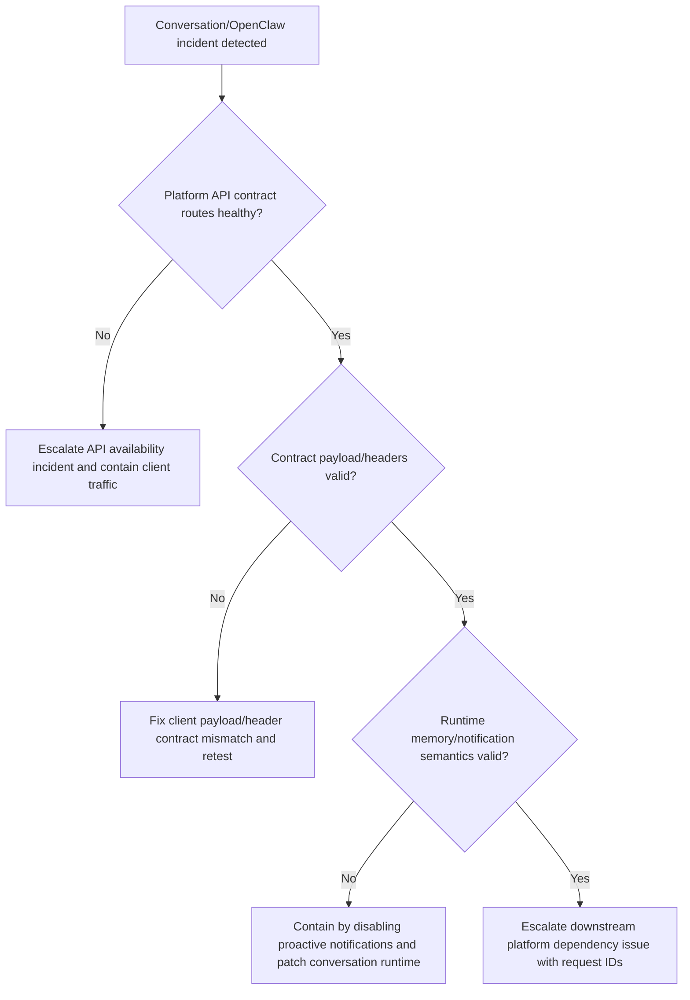
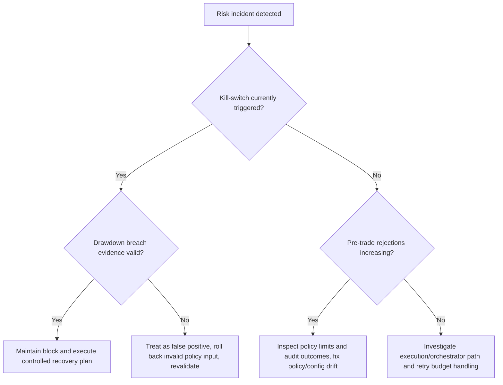

# Gate4 Incident Runbooks

## Scope

This runbook covers:

- conversation and OpenClaw incident response,
- risk rejection and kill-switch incident response,
- audit evidence capture and review handoff.

## Guardrails

1. Clients must use Platform API routes only.
2. No runbook step may call provider APIs directly from clients.
3. Side-effecting commands remain blocked when risk controls fail.
4. Every incident update must include correlation IDs and issue links.

## Severity Levels

| Severity | Trigger | SLA Target |
| --- | --- | --- |
| `SEV-1` | Side effects blocked across tenants or wrong-side execution risk | Immediate containment, 30-minute review handoff |
| `SEV-2` | Single-tenant contract failures, degraded suggestions, repeated kill-switch false positives | 2-hour mitigation |
| `SEV-3` | Isolated payload/client defects with known workaround | Next planned release |

## Runbook A: Conversation and OpenClaw

### Trigger Signals

- Elevated `4xx/5xx` for:
  - `POST /v2/conversations/sessions`
  - `GET /v2/conversations/sessions/{sessionId}`
  - `POST /v2/conversations/sessions/{sessionId}/turns`
- OpenClaw workflow breakage in contract/e2e checks.
- Missing `contextMemorySnapshot` or notification metadata in turn responses.

### Triage Checklist

1. Capture correlation: `requestId`, `sessionId`, `tenant_id`, `user_id`, `channel`.
2. Verify API contract path and auth headers with a minimal repro:

```bash
curl -sS -X POST "$PLATFORM_API_BASE/v2/conversations/sessions" \
  -H "Authorization: Bearer $TOKEN" \
  -H "X-API-Key: $API_KEY" \
  -H "X-Tenant-Id: $TENANT_ID" \
  -H "X-User-Id: $USER_ID" \
  -H "Content-Type: application/json" \
  -d '{"channel":"openclaw","topic":"incident-triage","metadata":{"notificationsOptIn":true}}'
```

3. Re-run deterministic contract coverage:

```bash
uv run --directory backend --with pytest python -m pytest \
  backend/tests/contracts/test_platform_api_v2_handlers.py \
  backend/tests/contracts/test_conversation_context_memory.py \
  backend/tests/contracts/test_conversation_proactive_notifications.py \
  backend/tests/contracts/test_openclaw_client_integration.py \
  backend/tests/contracts/test_openclaw_e2e_flow.py -q
```

4. Validate boundary invariants:
  - OpenClaw lane uses `channel=openclaw`.
  - No provider-direct client calls.
  - Errors are canonical contract errors with `requestId`.

### Decision Tree



### Containment Actions

1. Keep traffic on Platform API paths; do not introduce provider-direct fallback.
2. For unstable notification behavior, force `notificationsOptIn=false` at client feature flag until recovery.
3. If OpenClaw skill lane is degraded, fail over to CLI-mediated lane (still Platform API only).

### Recovery Checklist

1. Contract tests pass for v2 conversation handlers and OpenClaw e2e flow.
2. Repro requests return canonical success/error shapes with correlation IDs.
3. `contextMemory` and `contextMemorySnapshot` fields are deterministic across retries.
4. Incident summary is posted with root cause and prevention action.

## Runbook B: Risk Runtime and Kill-Switch

### Trigger Signals

- Sudden spikes in `422` risk limit rejections on:
  - `POST /v1/deployments`
  - `POST /v1/orders`
- `423` kill-switch rejections on side-effecting commands.
- Drawdown-triggered stop behavior firing unexpectedly or not firing when expected.

### Triage Checklist

1. Collect evidence: `requestId`, `deploymentId`/`orderId`, policy `version`, outcome code, and breach reason.
2. Validate risk controls with contract checks:

```bash
uv run --directory backend --with pytest python -m pytest \
  backend/tests/contracts/test_risk_policy_schema.py \
  backend/tests/contracts/test_risk_pretrade_checks.py \
  backend/tests/contracts/test_risk_killswitch_drawdown.py \
  backend/tests/contracts/test_risk_audit_trail.py \
  backend/tests/contracts/test_execution_command_layer.py \
  backend/tests/contracts/test_execution_command_idempotency.py -q
```

3. Verify stop and rejection behavior through Platform API only:
  - `GET /v1/deployments/{deploymentId}`
  - `POST /v1/deployments/{deploymentId}/actions/stop`
  - `POST /v1/orders`

4. Confirm policy compatibility:
  - accepted schema version is `risk-policy.v1`,
  - invalid schema/version must fail closed.

### Decision Tree



### Containment Actions

1. Preserve fail-closed behavior; do not bypass risk gates to force execution.
2. Keep side-effecting operations blocked while policy validity is uncertain.
3. Limit blast radius by tenant/account where configuration isolation is available.

### Recovery Checklist

1. Policy validation passes (`risk-policy.v1`, limits coherent, enums valid).
2. Drawdown breach and kill-switch transitions are reproducible and deterministic.
3. Risk audit trail contains both blocked and approved decisions with outcome codes.
4. Execution command layer remains idempotent after incident patch deployment.

## Evidence Capture

Collect and attach all of the following to the incident ticket:

1. Reproduction command(s) and responses with redacted secrets.
2. Correlation IDs (`requestId`) and timeline.
3. Relevant policy snapshot and schema/version validation result.
4. Contract test output used for verification.
5. Mitigation, rollback, and follow-up action items.

## Escalation Matrix

| Condition | Primary Team | Secondary Team | Escalate To |
| --- | --- | --- | --- |
| Conversation/OpenClaw contract drift | Team E | Team G | Parent `#80`, docs parent `#106` |
| Runtime state/retry anomalies | Team B | Team F | Parent `#77`, reliability `#81` |
| Risk rejection/kill-switch uncertainty | Team B | Team F | Parent `#77`, reliability `#81` |
| Audit evidence gap | Team F | Team G | Docs parent `#106`, reliability `#81` |

## On-Call Handoff Template

```md
Gate4 Incident Handoff

- Incident ID:
- Severity:
- Affected lane: conversation | openclaw | risk | runtime
- Start time (UTC):
- Current status: triage | contained | recovering | resolved
- Correlation IDs:
- Impact summary:
- Guardrails confirmed:
  - Platform API only: yes/no
  - No provider-direct client calls: yes/no
  - Risk fail-closed preserved: yes/no
- Verification commands executed:
- Remaining risks:
- Owner team:
- Review handoff target issue(s):
- Next decision checkpoint time (UTC):
```

## Traceability

- Conversation/OpenClaw docs:
  - `/docs/portal/platform/gate4-conversation-contract.md`
  - `/docs/portal/platform/gate4-openclaw-client-lane.md`
- Runtime/risk docs:
  - `/docs/portal/operations/gate4-orchestrator-controls.md`
  - `/docs/portal/operations/gate4-risk-policy-controls.md`
- Public API source: `/docs/architecture/specs/platform-api.openapi.yaml`
- Related issues: `#139`, `#81`, `#106`
