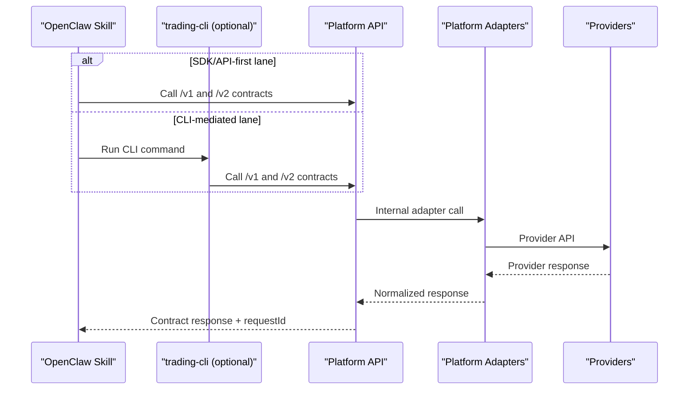

# Gate4 OpenClaw Client Lane

## Objective

Define OpenClaw as a first-class client lane without changing provider boundaries.

## Boundary Contract

1. OpenClaw is a client lane only.
2. OpenClaw calls Platform API contracts only.
3. OpenClaw must never call provider APIs directly.
4. Provider integrations remain adapter-only inside `trade-nexus` backend.
5. OpenClaw-specific backend behavior must be contract-first in OpenAPI.

## Allowed Call Paths

- OpenClaw skill -> SDK/API client -> Platform API
- OpenClaw skill -> `trading-cli` -> Platform API

Both paths are valid if they preserve auth, request correlation, and idempotency semantics defined in OpenAPI.

## Sequence: OpenClaw Request Path

## OC-02 Client Integration

Reference OpenClaw client integration is implemented in:

- `/backend/src/platform_api/clients/openclaw_client.py`

Behavior constraints:

1. Calls only canonical Platform API endpoints (`/v1/*`, `/v2/*`).
2. Initializes conversation sessions with `channel=openclaw`.
3. Preserves `Authorization`, `X-API-Key`, `X-Request-Id`, `X-Tenant-Id`, `X-User-Id`.
4. Includes `Idempotency-Key` for side-effecting operations that require it.
5. Performs no provider-direct calls.

## OC-03 End-to-End Flow Verification

OpenClaw flow tests validate the client path across core lifecycle operations:

1. Conversation session/turn bootstrap (`/v2/conversations/*`).
2. Research and strategy/backtest path (`/v1/research/*`, `/v1/strategies/*`, `/v1/backtests/*`).
3. Deployment/order execution path (`/v1/deployments/*`, `/v1/orders/*`).
4. Reporting path (`/v1/portfolios/*`).

Reference test:

- `/backend/tests/contracts/test_openclaw_e2e_flow.py`

## Explicitly Forbidden

- OpenClaw -> Lona API direct calls
- OpenClaw -> live-engine direct calls
- OpenClaw -> data provider direct calls
- Introducing undocumented `/v1/openclaw/*` endpoints

## Failure and Fallback Behavior

| Condition | Expected Behavior | Required Guardrail |
| --- | --- | --- |
| Platform API returns contract error | Return canonical error to OpenClaw | Preserve `requestId` for triage |
| Missing auth/idempotency headers | Reject request per API contract | Do not bypass to provider-direct calls |
| CLI wrapper failure | Retry via Platform API path only | Keep boundary; no provider fallback |
| Provider incident behind adapter | Platform API reports normalized error | OpenClaw remains client-only |

## Client Compatibility Notes

1. OpenClaw integrations can be implemented via SDK/API-first or CLI-mediated patterns.
2. Both patterns must preserve `Authorization`/`X-API-Key`, tenant/user headers, and request correlation.
3. Conversation bootstrapping must set `channel=openclaw`.
4. Side-effecting writes must include idempotency keys where OpenAPI requires them.

## Traceability

- Architecture contract: `/docs/architecture/OPENCLAW_INTEGRATION.md`
- Interface boundary: `/docs/architecture/INTERFACES.md`
- Public API source: `/docs/architecture/specs/platform-api.openapi.yaml`
- OC-02 contract tests: `/backend/tests/contracts/test_openclaw_client_integration.py`
- OC-03 e2e tests: `/backend/tests/contracts/test_openclaw_e2e_flow.py`
- Parent epics: `#80`, `#106`, `#81`
- Gate4 docs issue: `#137`
